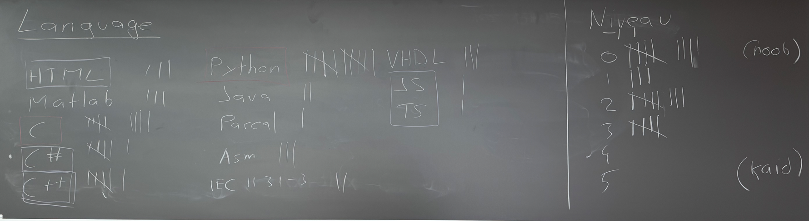

# Semaine 1/16

## Objectifs

1. Présentation du cours et du plan.
2. Prise de connaissance de la fiche d'unité.
3. Modalité d'évaluation.
4. Expérience de programmation des étudiants.
5. Activité Machine à café

## Expérience de programmation des étudiants



## Activité Machine à café


## Stockage de l'information

- L'unité de base de l'information est le **bit** (binary digit).
- Un bit peut prendre deux valeurs : 0 ou 1.
- Un **octet** (byte) est une séquence de 8 bits.
- Un octet peut représenter 256 valeurs différentes ($2^8$).
- La valeur binaire `0100100111001010` peut s'exprimer en hexadécimal par paquet de 4 bits : `49CA`. On peut faire des paquets de 3 bits pour l'octal : `1132`.
- Un caractère comme `A` est représenté par un octet. Par exemple, en ASCII, `A` est représenté par `01000001` (65 en décimal).
- Un **kilooctet** (kB) = 1 024 octets (2^10)
- Un **mégaoctet** (MB) = 1 024 kB (2^20)
- Un **gigaoctet** (GB) = 1 024 MB (2^30)
- Un **téraoctet** (TB) = 1 024 GB (2^40)

## Types de données

En programmation on utilise des types de données pour représenter l'information chaque type est associé à une taille en mémoire et une représentation de l'information binaire. En C les types les plus courants sont : 

| Type    | Taille (bytes) | Description                   |
| ------- | -------------- | ----------------------------- |
| `char`  | 1 (8 bit)      | Caractère (ex: 'A')           |
| `int`   | 4 (32 bit)     | Entier (ex: 42)               |
| `short` | 2 (16 bit)     | Petit entier (ex: 32000)      |
| `long`  | 8 (64 bit)     | Grand entier (ex: 1234567890) |

## Variable

En programmation réserver un espace mémoire pour stocker une valeur. On utilise une variable pour faire cela. En C on déclare une variable en spécifiant son type et son nom.

```c
int outsideTemperature = 23;
```

## Programme

```c
#include <stdio.h>

int main() {
    char outsideTemperature = 128;

    short outsideTemperatureF = outsideTemperature * 9/5 + 32;

    printf("Température extérieure: %hhd °C\n", outsideTemperature);
    printf("                        %hd °F\n", outsideTemperatureF);

    return 0;
}
```