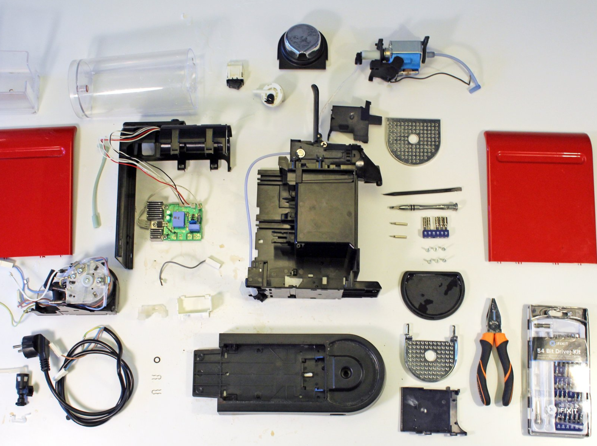

# Semaine 01/16

- [x] Activité : machine à café
- [x] Algorithmique au travers de l'algorithme d'Euclie
- [x] Représentation d'un algorithme sous forme d'un diagramme de flux
- [x] Implémentation de l'algorithme en C
- [x] Labo 00 

## Machine à café

## Outils

- Compilateur (GCC)
- Débogueur (GDB)
- GitHub 
- Git 
- Visual Studio Code (IDE)