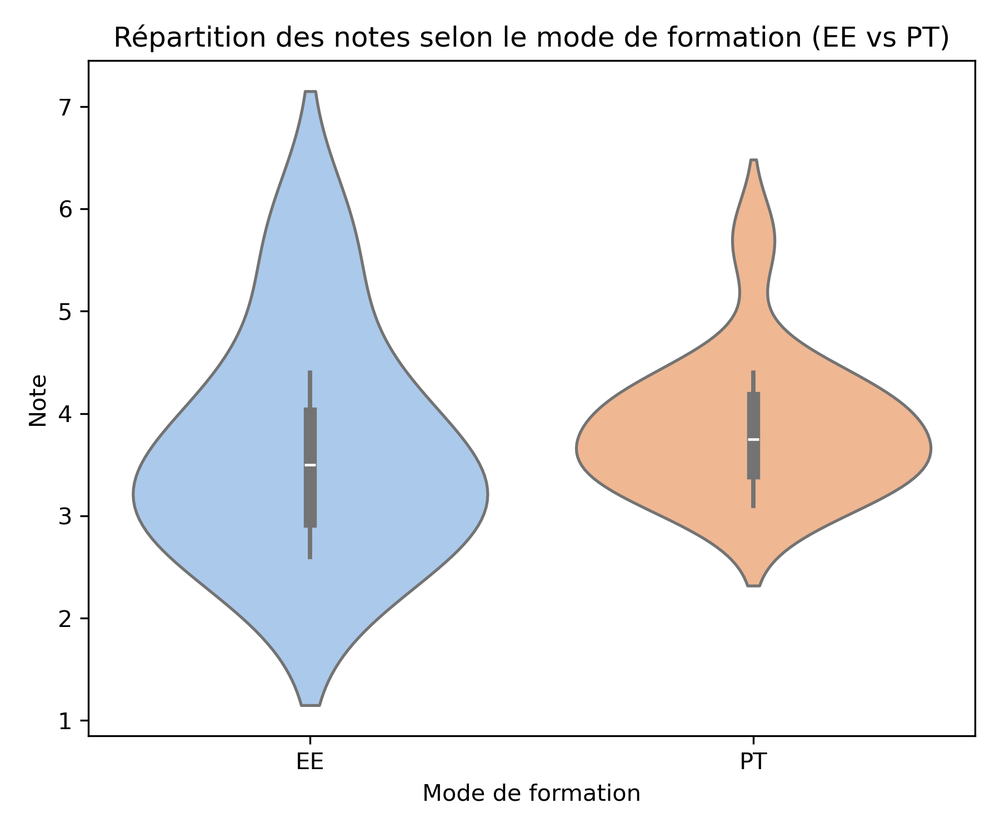
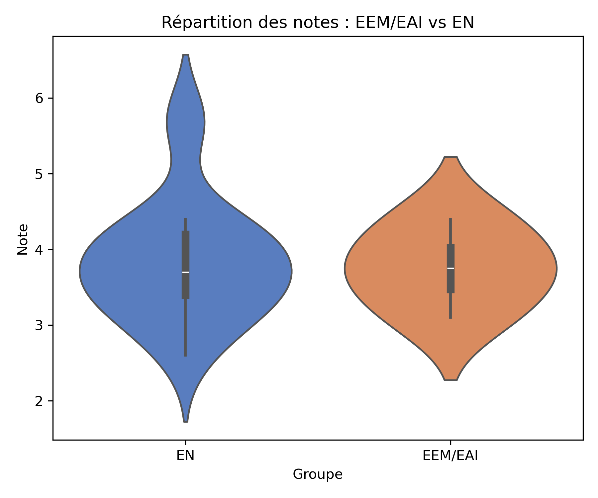
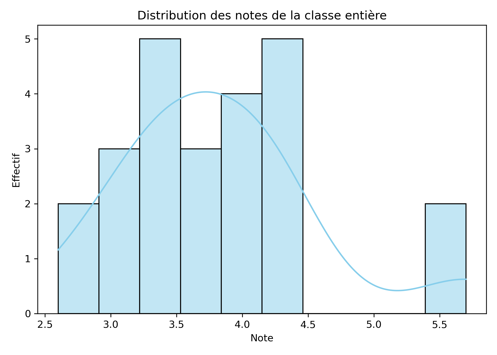

# Semaine 08/16 Mi-semestre

- [x] Correction du travail écrit
- [x] ++() ()++
- [ ] Fonctions 

// Semaine prochaine

- [ ] Notation en e
- [ ] Continue et break, éclairages
- [ ] Entiers normalisés modernes

## Opérateurs Postfix/Prefix

```c
int i = 5; 
int j = 7;

int k = i + j;
k = k + 1;
printf("%d", k); // 13
k += 1;
printf("%d", k); // 14

printf("%d", k++); // 14
printf("%d", k); // 15

printf("%d", ++k); // 16
printf("%d", k); // 16


if (int i = 0; i < 10; printf("Prout")) { i+=2; }
```


## Feedback TE

Les notes sont évaluées sur l'échelle suisse (1 = insuffisant, 6 = excellent).

### Répartition des modes de formation (EE vs PT)


La médiane des cours en présentiel (PT) reste légèrement au-dessus de celle des enseignements en entreprise (EE), mais les distributions se recouvrent fortement : l'écart perçu reste donc modéré et dépend surtout des cas particuliers.

### Regroupement EEM/EAI vs EN


Les filières EEM/EAI montrent une dispersion un peu plus resserrée autour d'une note médiane stable, tandis que les classes EN présentent à la fois quelques très bonnes notes (≈5.7) et davantage de valeurs moyennes. Cela suggère de travailler l'homogénéité des EN tout en capitalisant sur leurs excellents éléments.

### Distribution globale de la classe


La majorité des notes se situe entre 3 et 4.5, ce qui reste en dessous de la zone de confort (≥4). Les interventions ciblées devraient viser à hisser les notes faibles vers la barre de réussite tout en conservant les quelques pics proches de 6.


## Problème 3

```c
r = sscanf("  -15 0x1f", "%d %i", &n, &m);  // n = -15, m = 0, r = 2
r = sscanf("42kg", "%2d%c", &n, &ch);       // n = 42, ch = 'k', r = 2
r = sscanf("0.75,12", "%lf,%d", &y, &n);    // y = 0.75, n = 12, r = 2
r = sscanf("abc", "%d", &n);                // r = 0
r = sscanf("9.82", "%d %d", &n, &m);        // n = 9, r = 1
```

## Problème 4

```c
int s = 1;
while (s < 20) {
    printf("%d ", s);
    s <<= 1;
}

 s  s<20?  printf    s<<=1
 1  true   1         2
 2  true   2         4
 4  true   4         8
 8  true   8         16
 16 true   16        32
 32 false ....

"1 2 4 8 16 "
```

```c
for (int i = 5; i > 0; --i) {
    if (i % 2 == 0) { 
        continue;
    }
    printf("%d", i);
}

 i  i>0  i%2==0  printf  --i
 5  true false   5       4
 4  true true    ----->  3
 3  true false   3       2
 2  true true    ----->  1
 1  true false   1       0
 0  false ----------------

"531"


int total = 0;
for (int i = 1; i <=3; ++i) {
    for (int j = i; j <= 3; ++j)
       total += j;
}
printf("%d", total);

total   i=1  i<=3  j=i  j<=3  total+=j ++j   ++i
0       1    true  1    true  1        2
                        true  3        3
                        true  6        4
                        false ..........     2
             true  2    true  8        3     
                        true  11       4
                        false ..........     3
            true   3    true  14       4  
                        false ..........     4
            false ............................

total = 14


for (int i = 0; i < 3; ++i) {
    for (int j = 0; j < 3; ++j) {
        if (i == j) break;
        printf("%d%d ", i, j)
    }
}

i   i<3  j=0  j<3  i==j   %d%d  ++j ++i
0   true 0    true true ----------- 1
1   true 0    true 1==0   10    1   
              true 1==1 ----------- 2
    true 0    true 2==0   20    1 
              true 2==1   21    2
              true 2==2 ----------- 3
    false ---------

"10 20 21"


int i = 1, t = 0;
do {
    t += i;
    printf("%d;", t);
    i += 2;
} while (t < 15)

i  t   t+=i   %d,t  i+=2  t<15
1  0   1      1     3     true
3  1   4      4     5     true 
5  4   9      9     7     true 
7  9   16     16    9     false....

"1;4;9;16;"